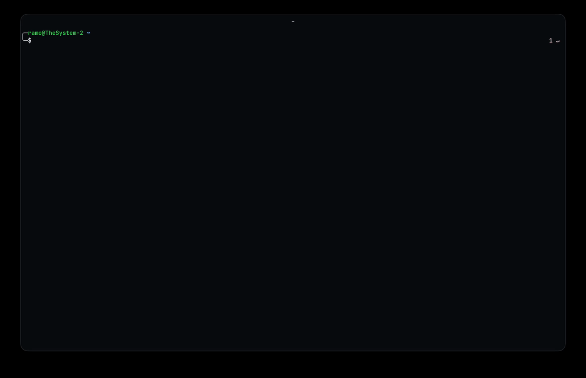

<h1 align="center">Zanat</h1>

<p align="center">
  <a href="https://www.npmjs.com/package/@iamramo/zanat-cli">
    
  </a>
  <a href="https://www.npmjs.com/package/@iamramo/zanat-cli">
    
  </a>
  <a href="https://opensource.org/licenses/MIT">
    
  </a>
</p>

<p align="center">
  <strong>Your personal skill library from any Git repository.</strong>
</p>

<p align="center">
  
</p>

## What is Zanat?

Zanat manages AI agent skills: markdown files that tell an agent how to behave in a specific situation. Skills live in a Git repository, so they are versioned, shareable, and easy to keep in sync across machines and teams.

You search for skills, add the ones you want, and they land in `~/.agents/skills/` where any compatible agent can pick them up. When the hub updates, you pull and update, just like any other dependency.

## Quick Start

```bash
npm install -g @iamramo/zanat-cli

zanat hub add  # point it at your hub repository
zanat skill search   # browse available skills
zanat skill add vercel.frontend.react-patterns
```

## Commands

| Command                               | Description                                             |
| ------------------------------------- | ------------------------------------------------------- |
| `zanat hub add`                       | Add a new hub interactively                             |
| `zanat hub rm <name>`                 | Remove a hub                                            |
| `zanat hub switch <name>`             | Switch the active hub                                   |
| `zanat hub list`                      | List all configured hubs                                |
| `zanat hub pull`                      | Pull latest changes from the hub                        |
| `zanat skill add [skill]`             | Add a skill, or all hub skills if no name is given      |
| `zanat skill add <skill> --pin=<ref>` | Add a skill pinned to a specific tag or commit          |
| `zanat skill rm [skill]`              | Remove a skill, or all added skills if no name is given |
| `zanat skill update [skill]`          | Update one or all non-pinned skills                     |
| `zanat skill list`                    | List added skills with version info                     |
| `zanat skill search [query]`          | Search available skills in the hub                      |
| `zanat show <skill>`                  | Show the full content of a skill                        |
| `zanat status`                        | Show hub and skills status                              |

See the [CLI README](./packages/cli/README.md) for the full reference.

## Version Tracking

Skills either track the hub branch by default or are pinned to a specific point in time.

```bash
zanat skill add vercel.frontend.react-patterns               # tracks hub branch
zanat skill add vercel.frontend.react-patterns --pin=v1.2.0  # pinned to tag
zanat skill add vercel.frontend.react-patterns --pin=abc1234 # pinned to commit
```

Tracked skills update when you run `zanat skill update`. Pinned skills never auto-update. Re-add without `--pin` to resume tracking.

## Writing Skills

A skill is a markdown file with a short YAML frontmatter header:

```markdown
---
name: code-review
description: Reviews code for quality, correctness, and readability
---

# Code Review

When reviewing code, focus on...
```

The only required fields are `name` and `description`. Everything below the frontmatter is the instruction content the agent will read.

Store skills in a Git repository organized by namespace. The directory path becomes the skill's identifier:

```
hub/anthropic/code-review/SKILL.md   →   anthropic.code-review
hub/vercel/frontend/react/SKILL.md   →   vercel.frontend.react
```

See [zanat-hub](https://github.com/iamramo/zanat-hub) for examples.

## MCP Server

Zanat ships a standalone MCP server so agents can manage skills programmatically: search, add, update, and remove without leaving the conversation.

```bash
npx @iamramo/zanat-mcp
```

Add it to your agent's MCP config:

```json
{
  "mcpServers": {
    "zanat": {
      "command": "npx",
      "args": ["@iamramo/zanat-mcp"]
    }
  }
}
```

| Tool            | Description                                    |
| --------------- | ---------------------------------------------- |
| `search_skills` | Search skills by name or content               |
| `list_skills`   | List added skills with version and pin status  |
| `get_skill`     | Get the full content of a skill                |
| `add_skill`     | Add a skill, optionally pinned to a tag or SHA |
| `update_skill`  | Update one or all non-pinned skills            |
| `remove_skill`  | Remove an added skill                          |

## Packages

| Package                            | Description                |
| ---------------------------------- | -------------------------- |
| [`packages/cli`](./packages/cli)   | CLI tool (`zanat` command) |
| [`packages/core`](./packages/core) | Shared core library        |
| [`packages/mcp`](./packages/mcp)   | MCP server                 |

## Development

```bash
git clone git@github.com:iamramo/zanat.git
cd zanat
npm install
npm run build
```

## License

MIT
